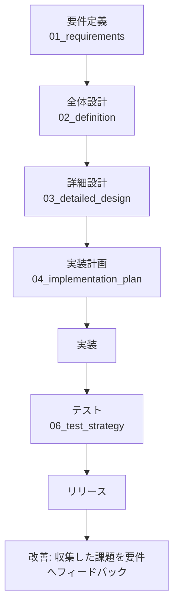

# サブスクリプション管理 iOSアプリ（自分用） - AIDD Overview

- **対象スコープ**: iPhone向けネイティブiOSアプリで「サブスク（定額課金）」を一覧・管理し、履歴を保持し、JSON/CSVで外部出力できるようにする。
- **作成日/更新日**: 2026-02-06
- **バージョン**: v0.1
- **ステータス**: Draft
- **想定読者**: PM / iOS Dev / QA / 運用（個人開発想定）
- **この資料の使い方**:
  - まず本書で「何を作る/作らない」「前提/未確定」を確認
  - 次に `01_requirements.md` で機能/非機能と受け入れ条件を確認
  - `02_definition.md` → `03_detailed_design.md` でアーキテクチャ/詳細仕様へ落とす
  - `04_implementation_plan.md` をそのままIssue化して実装し、`05_traceability.md` で漏れを防ぐ

---

## 背景
- スプレッドシート（Googleスプレッドシート/Excel）はPCでは便利だが、スマホ操作が難しく、日常的な確認・更新が億劫。
- メモアプリは分散しがちで、サブスク情報が散らばって管理が煩雑。
- iPhoneユーザーとして「見やすく・迷わず・すぐ更新できる」自分用のサブスク管理アプリが欲しい。
- 将来的には、エクスポートした履歴データを用いて可視化・分析などもできるようにしたい。

## 目的
- iPhone上で、サブスクの「現在の契約状況」と「過去/将来の請求履歴（実績/見込み）」を一元管理する。
- いつでもJSON/CSVでエクスポートでき、外部ツールで可視化・分析に回せる基盤を作る。

## 成功指標（KPI例）
- **入力のしやすさ**: 主要情報（サービス名/金額/周期/次回請求日）を30秒以内に登録できる。
- **継続使用**: 週1回以上、一覧で「月額合計」と「次回請求」を確認する運用が成立する。
- **管理品質**: サブスクの状態（Active/Paused/Cancelled）と履歴が矛盾しない（例: 解約後に請求が発生しない）。
- **データ可搬性**: JSON/CSVが互いに同等の情報を表現でき、再加工（可視化/集計）が可能。

## 現状課題（分かる範囲）
- モバイルでの表計算はUI的に辛く、継続的に更新しにくい。
- 既存のメモ運用は散らばり、検索・集計・棚卸しが難しい。

## スコープ概要

### 何を作る（In Scope / v0.1）
- サブスクの登録・編集・一覧・詳細
- 状態（利用中/一時停止/解約）管理
- 請求スケジュール生成（周期・開始日・次回請求日から見込み履歴を生成）
- 請求履歴（見込み/確定）管理（最低限、確定にする操作）
- 集計（当月/年間の合計、カテゴリ別）
- JSON/CSVエクスポート（Share Sheet / ファイル保存）

### 何を作らない（Out of Scope / v0.1）
- 銀行/クレカ明細の自動取り込み
- サブスク決済の自動検知（Push連携など）
- 複数端末同期（iCloud/CloudKit）※将来候補
- 多言語対応（日本語のみ）
- 収支家計簿のフル機能化（本アプリはサブスクに特化）

## 主要ステークホルダーと責務（RACI案）
| 役割 | 人（想定） | 責務 | RACI |
|---|---|---|---|
| プロダクトオーナー | あなた | 目的/スコープ決定、受け入れ判断 | A/R |
| iOS開発 | あなた（または協力者） | 設計・実装・リリース | R |
| QA | あなた（将来は協力者） | テスト設計/実施、品質担保 | R |
| 運用 | あなた | クラッシュ監視、問い合わせ対応（最小限） | R |

## 全体の流れ（要件→設計→実装→テスト→リリース）

## 既存資産の調査結果（ワークスペース）
- 現時点のワークスペース上に、既存コード/README/設計資料は確認できなかったため、本資料は**新規プロジェクト前提**で作成。

## 仕様ドキュメント一覧
- `01_requirements.md` 要件（FR/NFR、受け入れ条件）
- `02_definition.md` 全体設計（アーキテクチャ、方針、図）
- `03_detailed_design.md` 詳細設計（モデル、画面、エクスポート仕様、疑似コード）
- `04_implementation_plan.md` 実装計画（Issue化できる粒度）
- `05_traceability.md` トレーサビリティ（FR/NFR→設計→タスク→テスト）
- `06_test_strategy.md` テスト戦略（推奨）
- `07_prompt_library.md` プロンプト集（推奨）

## Glossary（用語集）
| 用語 | 定義 | 備考 |
|---|---|---|
| サブスク | 定額課金/定期課金サービス | 例: 音楽/動画/クラウド/アプリ課金 |
| サブスク項目（Subscription） | 1つのサービス契約を表すデータ | サービス名、金額、周期、状態など |
| 請求周期（Billing Cycle） | 課金が発生する繰り返し | 月次/年次/週次/カスタム |
| 請求イベント（Billing Event） | 請求の1回分（履歴行） | 見込み/確定を区別 |
| 見込み（Projected） | ルールから生成された将来/過去の予定 | 実際の支払いとズレる可能性 |
| 確定（Confirmed） | ユーザーが「支払った」と確定した履歴 | v0.1では手動確定 |
| 状態（Status） | Active/Paused/Cancelled | 解約はCancelled |
| エクスポート | アプリ外へデータを出す | JSON/CSV |
| PII | 個人情報 | 本アプリでは原則扱わない（注意は必要） |

---

## Assumptions（前提）
- iOSネイティブ（SwiftUI）で実装し、**バックエンドは持たない**（ローカル完結）。
- 最低サポートOSは **iOS 17** を想定（SwiftData採用のため）。
- 通貨はまずJPY（円）をデフォルトにし、将来拡張として多通貨を許容。
- 「履歴」は、(a) ルールから生成した見込み と (b) ユーザーが確定した実績 を同一モデルで扱う。

## Open Questions（未確定事項）
1. リリース形態: 完全に自分用（TestFlight/個人配布）か、App Store公開も前提か？
2. iCloud同期: 将来欲しいか（優先度低ならOut of Scopeのまま）？
3. 請求の「確定」方法: 手動確定のみでOKか、リマインド通知を入れるか？
4. パスコード/FaceIDロック: 必要か（家計情報に近いので人によっては欲しい）？
5. インポート: v0.1で不要か（エクスポートのみ）？

## Decisions（決定事項）
- v0.1はローカル完結・バックエンドなし。
- v0.1の主要差別化は「スマホでの入力/閲覧のしやすさ」と「JSON/CSVエクスポート」。

## Out of Scope（やらないこと）
- 自動明細取り込み・自動課金検知
- iCloud同期
- 高度な可視化（グラフ/ダッシュボード）は将来（外部で実施できるようにエクスポートを整備）

---

## AIDD Bot Review（品質ゲート自己チェック）
- [x] 要件はID付与し、受け入れ条件を付与する（`01_requirements.md`）
- [x] 非機能（性能/可用性/運用/監視/セキュリティ/コスト/保守性/アクセシビリティ）を最低限含める
- [x] 設計が要件に対応し、トレーサビリティを作成する（`05_traceability.md`）
- [x] 実装ステップは具体で、テストまで含む（`04_implementation_plan.md` / `06_test_strategy.md`）
- [x] Open Questions と Assumptions を分離して記載
- [x] Out of Scope を明記
