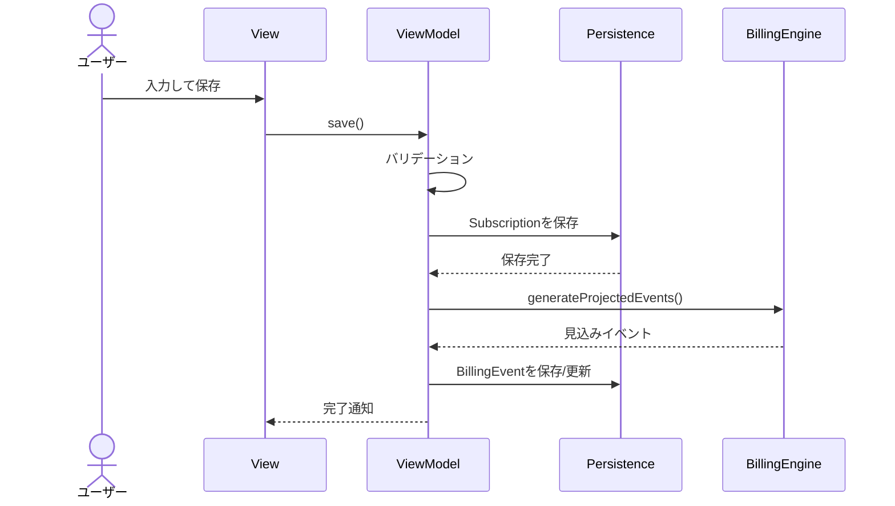
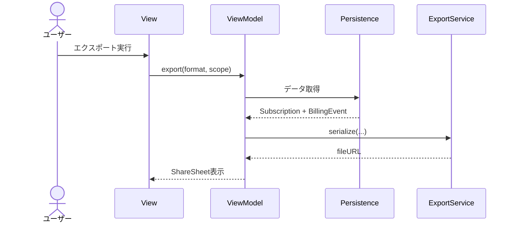

# 定義（System Definition / Architecture）: サブスクリプション管理 iOSアプリ

- **対象スコープ**: ローカル完結のiOSアプリの全体アーキテクチャ、コンポーネント境界、主要フロー、運用方針。
- **作成日/更新日**: 2026-02-06
- **バージョン**: v0.1
- **ステータス**: Draft
- **想定読者**: PM / iOS Dev / QA / 運用
- **この資料の使い方**:
  - 実装前に「どこに何を書くか（境界）」を合意する
  - 後から機能追加しても破綻しないよう、データモデル/エクスポート/計算ロジックの置き場を決める

---

## システムコンテキスト図
```mermaid
flowchart LR
  U[ユーザー] -->|入力/閲覧| APP[iOS App
(Subscription Tracker)]
  APP <--> DB[(ローカルDB
SwiftData)]
  APP -->|JSON/CSV生成| FILES[ファイル
(temp/Documents)]
  APP -->|Share Sheet| SHARE[iOS共有シート]
  SHARE --> EXT[他アプリ/Files/メール等]

  subgraph iOS端末内
    APP
    DB
    FILES
    SHARE
  end
```

## コンポーネント構成
### 全体方針
- **UI（SwiftUI）** と **ドメインロジック（計算/エクスポート）** と **永続化（SwiftData）** を分離する。
- 画面はMVVM（View + ViewModel）を採用し、ViewModelはUseCase/Serviceを呼ぶ。

### コンポーネント一覧
| コンポーネント | 責務 | 依存 | 備考 |
|---|---|---|---|
| Presentation (SwiftUI Views) | 画面表示、ユーザー入力、ナビゲーション | ViewModel | ビジネスロジックを持たない |
| ViewModel | 画面状態管理、入力バリデーション、UseCase呼び出し | Domain/UseCase | Swift Concurrency / Combineは最小 |
| Domain Model | Subscription/BillingEvent等のコア概念 | - | SwiftDataモデルと分離するかは実装都合で選択 |
| BillingEngine | 次回請求日計算、見込みイベント生成 | Calendar/Settings | 月末/うるう年の規則を集約 |
| ExportService | JSON/CSV生成、ファイル書き込み、Share Sheet連携 | Persistence/BillingEngine | フォーマットのバージョン管理 |
| Persistence (SwiftData) | CRUD、クエリ、マイグレーション | SwiftData | ローカル完結 |
| SettingsStore | 設定（デフォルト通貨、履歴範囲） | UserDefaults | 変更をUIへ反映 |
| Logging | OSLogでイベント/エラー記録 | OSLog | PIIを避ける |

## 主要データフロー
### 1) サブスク登録→履歴生成


### 2) エクスポート（JSON/CSV）


## 技術選定（v0.1）
| 項目 | 採用 | 理由 | 代替案 |
|---|---|---|---|
| UI | SwiftUI | iOS標準、個人開発でも速度が出る | UIKit |
| 永続化 | SwiftData（iOS17+） | モデル定義が簡単、CRUDが素直 | CoreData / SQLite |
| 設定 | UserDefaults | 軽量で十分 | SwiftDataに統合 |
| ログ | OSLog | 端末内・PII制御しやすい | 独自ログ |
| テスト | XCTest / XCUITest | iOS標準 | - |

## 認証/認可
- v0.1は**ユーザーアカウントなし**（端末内データ）。
- 認可は不要。
- 端末ロック/アプリロック（FaceID/Passcode）は **Open Question**（必要ならv0.2以降）。

## エラーハンドリング方針
### エラー分類
| 分類 | 例 | ユーザーへの見せ方 | リトライ |
|---|---|---|---|
| ValidationError | 必須未入力、金額が負数 | フォーム下にエラー表示 | 不要 |
| PersistenceError | 保存失敗、整合性違反 | トースト/アラート「保存に失敗」 | 1回再試行（任意） |
| CalculationError | 日付計算不能（異常データ） | アラート + 該当項目を編集促し | 不要 |
| ExportError | ファイル書き込み失敗 | アラート「エクスポート失敗」 | 再実行 |

### 例外/失敗時の基本方針
- 破壊的変更（削除/解約）は**確認ダイアログ**。
- エクスポートは**生成→共有**の2段階。生成に失敗したら共有は出さない。

## ログ/監視/アラート方針（最小）
- ログ: OSLog
  - `app.lifecycle`（起動/終了）
  - `subscription.crud`（作成/更新/削除）※サービス名はマスク/省略
  - `export`（形式、件数、所要時間、失敗理由）
- 監視: v0.1ではクラッシュ監視が中心
  - Xcode Organizer（App Store/TestFlight）
  - 任意: Crashlytics
- SLO案（あくまで目安）
  - クラッシュフリー率 99%以上
  - 主要画面の操作遅延が体感でストレスにならない

## デプロイ/環境
- 環境
  - dev: ローカル実行
  - stg: TestFlight（任意）
  - prod: App Store（公開する場合）
- 設定管理
  - ビルド設定でBundle IDや環境分岐
  - Secretsは基本不要（バックエンドなし）

## 互換性/移行方針
- DBスキーマ変更
  - SwiftDataのマイグレーション方針を採用（小さな変更を積み重ねる）
- エクスポート互換性
  - JSONに `schemaVersion` を付与
  - CSVは列を追加する場合、末尾追加で後方互換を維持

## セキュリティ基本方針
- ネットワーク通信をしない（v0.1）
- 端末のサンドボックス内に保存（iOSの暗号化保護を前提）
- PIIをログに出さない
- エクスポートファイルは一時領域に生成し、共有後に削除する（可能な範囲）

---

## Assumptions（前提）
- iOS 17+ / SwiftData採用
- サブスク情報は個人利用であり、複数ユーザー/同期は考えない

## Open Questions（未確定事項）
- iCloud同期（CloudKit）の必要性
- アプリロック（FaceID）の必要性

## Decisions（決定事項）
- v0.1はバックエンドなし、ローカル完結

## Out of Scope（やらないこと）
- 外部API連携（銀行/カード/メール）
- 複数端末同期
