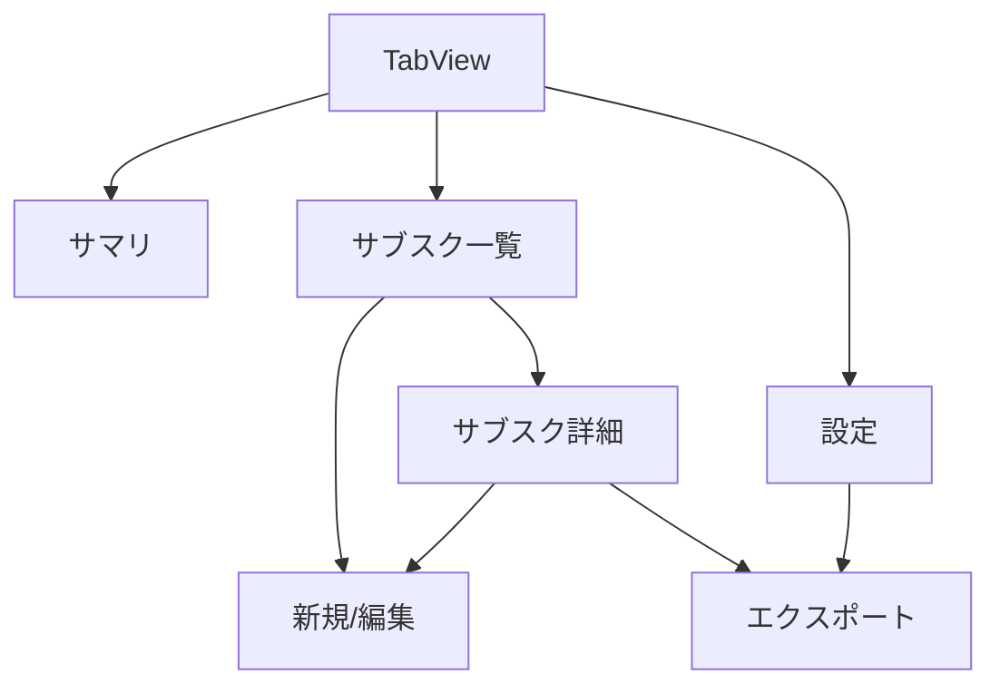
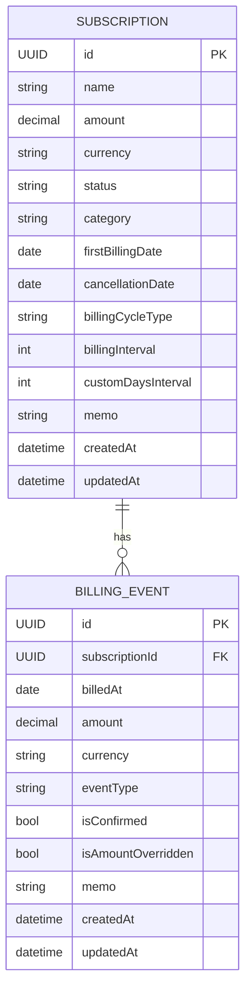
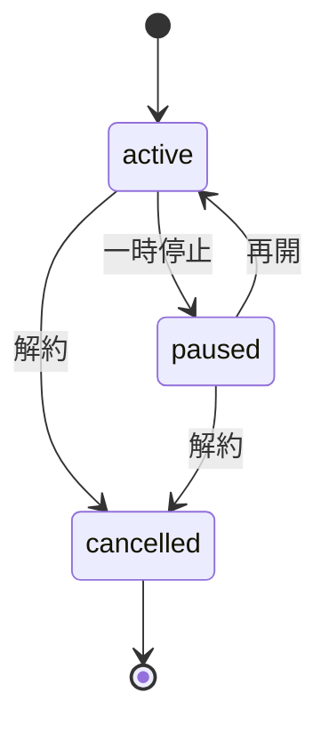

# 詳細設計（Detailed Design）: サブスクリプション管理 iOSアプリ

- **対象スコープ**: 実装者が迷わない粒度の設計（ディレクトリ/モデル/画面/計算/エクスポート/例外/ログ/テスト観点）。
- **作成日/更新日**: 2026-02-06
- **バージョン**: v0.1
- **ステータス**: Draft
- **想定読者**: iOS Dev / QA
- **この資料の使い方**:
  - 実装中に「どのデータを持つか」「どう計算するか」「どう出力するか」で迷ったらここに戻る
  - 受け入れ条件は `01_requirements.md` を一次ソースとし、本書は実装の解像度を上げる

---

## 1. モジュール/ディレクトリ設計（案）

```
SubscriptionTracker/
  App/
    SubscriptionTrackerApp.swift
  Features/
    Summary/
    Subscriptions/
    Export/
    Settings/
  Domain/
    Models/
    Services/
  Data/
    Persistence/
    Repositories/
  Common/
    Extensions/
    Components/
    Logging/
    Utils/
  Tests/
    DomainTests/
    ExportTests/
    UITests/
```

### 命名規約（最低限）
- View: `FooView` / ViewModel: `FooViewModel`
- Service: `FooService` / Engine: `FooEngine`
- SwiftDataモデルは `SubscriptionEntity` のようにEntity接尾辞も可（好みで統一）

---

## 2. 画面設計（UI）

### 2.1 画面遷移


### 2.2 画面ごとの責務
- サマリ: 今月合計（見込み/確定）、カテゴリ別（v0.1は簡易でも可）、直近の請求イベント上位N件
- 一覧: 検索/状態フィルタ、サブスクカード表示（次回請求日・金額・状態）
- 詳細: サブスク基本情報、履歴（見込み/確定）、確定/金額上書き/メモ
- エクスポート: 形式選択（JSON/CSV）、対象選択（定義/履歴/両方）、範囲（過去N/未来M）
- 設定: デフォルト通貨、履歴生成範囲、Pausedの集計扱い等

---

## 3. データモデル設計（SwiftData想定）

### 3.1 ER図（概念）


> 注: SwiftDataでは `@Relationship` を使い、FKは明示せず関連で表現する。

### 3.2 Subscriptionモデル（案）
- `id: UUID`
- `name: String`（必須）
- `amount: Decimal`（必須、0以上）
- `currency: String`（ISO 4217の想定、v0.1は"JPY"）
- `status: SubscriptionStatus`（`active | paused | cancelled`）
- `category: String?`（将来はenum/別テーブルも検討）
- `firstBillingDate: Date`（**初回請求日**。無料トライアル対応のため開始日ではなく初回請求日を採用）
- `cancellationDate: Date?`（status=cancelledの場合に必須）
- `billingCycle: BillingCycle` 相当のフィールド
  - `billingCycleType: BillingCycleType`（`monthly | yearly | customDays`）
  - `billingInterval: Int`（月次なら何ヶ月ごと、年次なら何年ごと。v0.1は1固定でもOK）
  - `customDaysInterval: Int?`（type=customDaysの時）
- `memo: String?`
- `createdAt / updatedAt: Date`

#### インデックス/制約（方針）
- `name` はユニークにはしない（同名サービスの可能性）
- `status` でフィルタするので、DBが許すならインデックス候補

### 3.3 BillingEventモデル（案）
- `id: UUID`
- `subscription: Subscription`（relationship）
- `billedAt: Date`（その回の請求日。**日付はローカルタイムゾーン基準**）
- `amount: Decimal`
- `currency: String`
- `eventType: BillingEventType`（`projected | confirmed`）
  - v0.1は `isConfirmed: Bool` でも可だが、将来拡張しやすいのでeventType推奨
- `isAmountOverridden: Bool`（その回だけ上書きしたか）
- `memo: String?`
- `createdAt / updatedAt: Date`

#### インデックス/制約（方針）
- `subscription` + `billedAt` は同一イベントの重複を避けたいので、アプリロジックで重複防止

---

## 4. 状態管理

### 4.1 SubscriptionStatus の遷移


### 4.2 状態と履歴生成のルール（v0.1）
- `active`: 見込み履歴を生成する
- `paused`: 見込み履歴は生成するが、集計に含めるかは設定で選べる（デフォルト除外）
- `cancelled`: `cancellationDate` 以降の見込み履歴を生成しない

---

## 5. 主要アルゴリズム

### 5.1 次回請求日計算（基本方針）
- **アンカー**: `firstBillingDate` を起点に周期を足していく
- **月次/年次の月末ルール**:
  - 例: 1/31の月次 → 2月は2/28(または2/29)、3月は3/31
  - つまり「同じ日付が存在しない月は、その月の末日」に丸める

### 5.2 見込みイベント生成（過去Nヶ月〜未来Mヶ月）

擬似コード：
```pseudo
function generateProjectedEvents(subscription, rangeStart, rangeEnd):
  anchor = subscription.firstBillingDate
  if subscription.status == cancelled and subscription.cancellationDate != null:
    rangeEnd = min(rangeEnd, subscription.cancellationDate)

  // 1) anchor以前にrangeStartがある場合、rangeStartに入る最初の請求日まで進める
  date = anchor
  while date < rangeStart:
    date = addCycle(date, subscription.cycle)

  // 2) range内を進めてイベント列を作る
  events = []
  while date <= rangeEnd:
    events.append(date)
    date = addCycle(date, subscription.cycle)

  return events
```

`addCycle(date, cycle)`:
- monthly: calendar.addMonths(date, interval) with end-of-month clamp
- yearly: calendar.addYears(date, interval) with end-of-month clamp
- customDays: date + intervalDays

### 5.3 編集時の再生成戦略（重要）
- **原則**: confirmedイベントは守る。projectedイベントは再生成して良い。
- 更新フロー（案）
  1. 該当サブスクの `projected` イベントを生成範囲内で削除
  2. 最新定義で `projected` を再生成
  3. ただし `confirmed` と同日付のprojectedは作らない（重複防止）
  4. amount変更時は、再生成したprojectedに新amountを適用

---

## 6. エクスポート設計（外部I/O）

### 6.1 JSONフォーマット（v0.1案）
- 目的: 将来の可視化・別ツール投入に耐える
- 方針: **フラットに近い構造 + 参照ID**

```json
{
  "schemaVersion": "1.0",
  "exportedAt": "2026-02-06T12:34:56+09:00",
  "settings": {
    "timezone": "Asia/Tokyo",
    "historyRange": {"pastMonths": 6, "futureMonths": 12}
  },
  "subscriptions": [
    {
      "id": "UUID",
      "name": "Netflix",
      "status": "active",
      "category": "entertainment",
      "amount": 1200,
      "currency": "JPY",
      "firstBillingDate": "2025-01-10",
      "cancellationDate": null,
      "billingCycle": {"type": "monthly", "interval": 1},
      "memo": "",
      "createdAt": "2025-01-01T00:00:00+09:00",
      "updatedAt": "2026-02-01T00:00:00+09:00"
    }
  ],
  "billingEvents": [
    {
      "id": "UUID",
      "subscriptionId": "UUID",
      "billedAt": "2026-02-10",
      "amount": 1200,
      "currency": "JPY",
      "eventType": "projected",
      "isAmountOverridden": false,
      "memo": "",
      "createdAt": "2026-02-06T12:00:00+09:00",
      "updatedAt": "2026-02-06T12:00:00+09:00"
    }
  ]
}
```

#### JSONルール
- `schemaVersion`: 破壊的変更時に上げる（例: 1.0 → 2.0）
- 日付
  - `firstBillingDate` / `billedAt` は `YYYY-MM-DD`（日付として扱いやすい）
  - `exportedAt` などはISO8601（タイムゾーン付き）
- 金額
  - v0.1は整数（円）を基本。
  - 将来小数が必要なら `amount` を文字列化 or `minorUnits` を併用する（Open Question）

### 6.2 CSVフォーマット（v0.1案）
- 1行=1請求イベント（履歴分析がしやすい）
- ヘッダ固定、追加は末尾

列（順序固定）：
1. event_id
2. subscription_id
3. subscription_name
4. subscription_status
5. category
6. billed_at
7. amount
8. currency
9. event_type
10. is_amount_overridden
11. memo

例：
```csv
event_id,subscription_id,subscription_name,subscription_status,category,billed_at,amount,currency,event_type,is_amount_overridden,memo
..., ...,Netflix,active,entertainment,2026-02-10,1200,JPY,projected,false,
```

#### CSVルール
- カンマ区切り、ダブルクォートエスケープ
- 改行を含むmemoはダブルクォートで囲う

### 6.3 ファイル出力と共有
- `FileManager.default.temporaryDirectory` 配下に生成
- ファイル名規則（案）
  - `subscriptions_export_YYYYMMDD_HHMMSS.json`
  - `subscriptions_events_YYYYMMDD_HHMMSS.csv`
- 共有後、OSが許す範囲で一時ファイル削除

---

## 7. バリデーション仕様
- Subscription
  - name: 空禁止、最大100文字
  - amount: 0以上（上限は1,000,000程度で良い）
  - currency: v0.1は"JPY"固定も可
  - firstBillingDate: 必須
  - cancelledの場合はcancellationDate必須
- BillingEvent
  - billedAt必須
  - amount: 0以上

---

## 8. 例外系の仕様
- 保存失敗: 「保存できませんでした。再度お試しください」
- エクスポート失敗: 「エクスポートに失敗しました。容量/権限をご確認ください」
- 計算不能: 「請求日の計算に失敗しました。日付設定を見直してください」

---

## 9. ロギング設計（PIIマスキング）
- 基本: OSLogに出すのは「件数」「所要時間」「成功/失敗理由」まで
- 出さない: memo本文、サービス名（出しても良いが、念のためマスク推奨）
- 例
  - `export.success format=csv events=240 duration_ms=120`
  - `db.save.failed error=...`

---

## 10. テスト観点（抜粋）
- ドメイン
  - 請求日計算（月末、うるう年、interval）
  - cancelledの境界（cancellationDateちょうど/翌日）
  - confirmedを保持した再生成
- エクスポート
  - JSONスキーマ（必須フィールド、schemaVersion）
  - CSVエスケープ（カンマ/改行/ダブルクォート）
- UI
  - CRUD導線
  - フィルタ/検索

---

## 11. パフォーマンス観点
- 履歴リストは件数が増えるので
  - 表示範囲を制限（設定N/M）
  - ソート/フィルタはDBクエリ側に寄せる
- エクスポートはバックグラウンド（Task）で実行し、UIはプログレス表示

---

## 12. 依存ライブラリ/外部サービス
- 標準のみ（v0.1）
  - SwiftUI
  - SwiftData
  - Foundation (Codable/Date)
  - OSLog
- 任意（運用）
  - Firebase Crashlytics（入れるならv0.1後半/ v0.2）

---

## Assumptions（前提）
- JSONの金額は整数（JPY）を基本

## Open Questions（未確定事項）
- 小数/多通貨の扱い（minorUnits方式にするか）
- Pausedを集計に含めるか（設定で切替）

## Decisions（決定事項）
- JSONにはschemaVersionを含める

## Out of Scope（やらないこと）
- インポート（読み込み）
- 外部API連携
